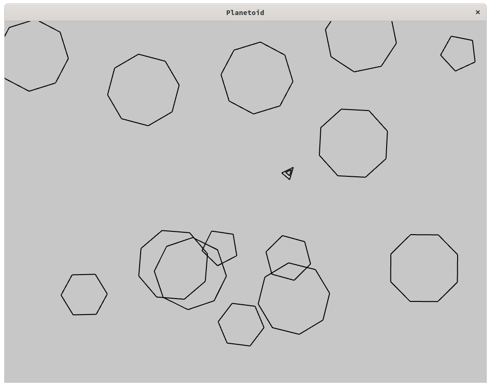

# Planetoid

Planetoid is a toy project to demonstrate and learn several technologies.
The goal is to create a little multiplayer [asteriod](https://en.wikipedia.org/wiki/Asteroids_(video_game)) game clone.
* Server side is a [Quarkus](https://quarkus.io/) application using websockets derived from the chat example. The goal of this application is currently to:
  * Pass game messages between clients.
  * Show games in progress and terminated with participants and winner.
  * Allow users to authenticate and add comments to a specific game.
* Client side is a [Rust](https://www.rust-lang.org/) application using [macroquad](https://github.com/not-fl3/macroquad) framework. As well, it was derived from the asteroid example, but refactored in a more object oriented code. It can be compiled as:
    * A native application that will use websockets ([tungstenite](https://github.com/snapview/tungstenite-rs)) to share game data. Only Linux has been fully tested so far, but it should run on Windows/MacOs as well.
    * A wasm32 application, that can be run in a browser. Currently websockets are not implemented, but the game can be played in solo mode.
* Deployment on [Kubernetes](https://kubernetes.io/) for the server and the required infrastructure to capture metrics ([Prometheus](https://prometheus.io/) / [Grafana](https://grafana.com/)) as well as authentication ([Keycloak](https://www.keycloak.org/)) and persistance ([Postgres](https://www.postgresql.org/)).


This project is in an early stage, so a lot of features are missing and need to be implemented. However, as stated at the beginning, the goal is not to propose a real game but a demo to explain and share about these technologies.

## Project current status
* Clients (native and wasm) can be built.
* Native client can share the game with a spectator. Spectator is another native client started in the spectator mode.
* WIP add multiplayer.
* WIP send player names to server to display current games.
* WIP store games results.

## Authors

- [@Uggla](https://www.github.com/Uggla)


## Screenshots

Native application:


Running the wasm application into Firefox:


## Run Locally (mainly for development purpose)

1. Clone the project

```bash
  git clone https://github.com/uggla/planetoid
```

2. Go to the project directory

```bash
  cd planetoid
```

### Server

1. Install OpenJDK 11 following the instructions [here](https://adoptopenjdk.net/installation.html#) or install it using your distribution package manager.
Ex on Fedora

```bash
  dnf install java-11-openjdk-devel
```

2. Install maven > 3.6 following the instructions [here](https://maven.apache.org/install.html) or install it using your distribution mackage manager. Ex on Fedora:

```bash
  dnf install maven
```

3. Go to the server directory and run the server in dev mode

```bash
cd server
mvn compile quarkus:dev
```
*Note: maven will download a lot of dependencies from the internet*


### Client

#### Native client
1. Install Rust following the instructions [here](https://www.rust-lang.org/fr/learn/get-started).
   
   *Tips: the rustup method is the simplest method.*

2. Install required library for macroquad

* Ubuntu system dependencies
```bash
apt install pkg-config libx11-dev libxi-dev libgl1-mesa-dev libasound2-dev
```

* Fedora system dependencies
```bash
dnf install libX11-devel libXi-devel mesa-libGL-devel alsa-lib-devel
```

3. Go to the client directory and run the native client
```bash
cd client
cargo run -- Planetoid
```

#### Wasm32 client

1. Follow the above instruction of the native client.

2. Install basic-http-server
```bash
cargo install basic-http-server
```

3. Add the wasm32 compilation target
```bash
rustup target add wasm32-unknown-unknown
```

4. Go to the client directory and run the native client
```bash
cd client
cargo build --target wasm32-unknown-unknown
```

5. Serve the files and open the browser
```bash
basic-http-server
xdg-open http://127.0.0.1:4000
```

<!-- ## Installation -->

<!-- Install my-project with npm -->

<!-- ```bash -->
<!--   npm install my-project -->
<!--   cd my-project -->
<!-- ``` -->


## Native client usage
```
planetoid 0.1.0
Planetoid is a asteroid clone

USAGE:
    planetoid [FLAGS] [OPTIONS] <name>

FLAGS:
    -d, --debug      Debug mode (_ (error), -d (info), -dd (debug), -ddd (trace))
    -g, --god        God mode
        --help       Prints help information
    -s, --solo       Solo mode, do not connect to network
    -V, --version    Prints version information

OPTIONS:
    -h, --host <host>    Host [default: localhost]
    -m, --mode <mode>    Network mode [default: host]  [possible values: host, guest, spectator]
    -p, --port <port>    Port [default: 8080]

ARGS:
    <name>    Player name
```
### Examples
#### Running in solo mode
`cargo run -- -s Planetoid`

#### Running in network mode with a spectator
On the first terminal:
`cargo run -- -m host Planetoid`

On the second terminal:
`cargo run -- -m spectator "Planetoid spectator"`

#### Running in network mode, debug and as god
`-dd`: debug allow to see messages sent to the web socket.

`-g`: god mode, ship cannot be destroyed.

`cargo run -- -m host -dd -g Planetoid`

